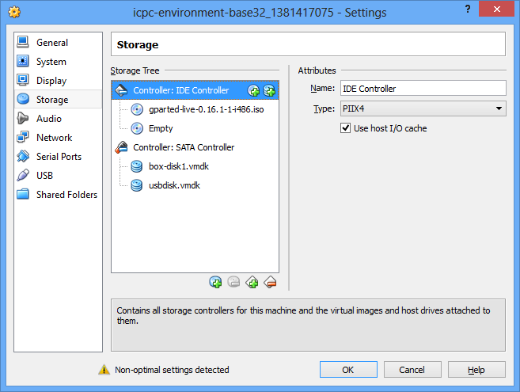

Custom Vagrant Boxes
==================

To make the experience as friendly as possible for the contestants, we use a custom partition layout.  This requires some manual setup.

Note: If you don't intend to customize these, you can use the ones provided by me.  This file just documents how you can build your own if you would like.

For the US ACM SouthEast Region ICPC, we use a 32bit image for maximum compatibility.  If you know that everyone will be using 64bit capable machines, you may decide to use the 64bit image.


## Building a base box
1. `vagrant up` (Wait for this to finish)
2. `vagrant halt`
3. Open virtualbox, then open the settings for the machine named 'icpc-environment-base32_##########'
4. Add a new virtual hard disk to the sata controller for the machine.
    * Hard Drive File Type: VMDK
    * File size: 7.00 GB
    * File location: usbdisk
5. Attach a live-cd to one of the cd drives.  I use gparted for this step.  Your settings should look something like this now:
<!---->
6. Start the VM, then boot from the cd(press F12)
7. If using gparted, accept the defaults for booting, and then wait for GParted to launch in the GUI.
8. From the dropdown in the top right, select /dev/sdb.
9. From the menu, choose Device, then "Create Partition Table".  The default of MS-DOS is fine. Click Apply.
10. Create partitions as follows:
        | partition | file system | size       | label |
        |-----------|-------------|------------|-------|
        | /dev/sdb1 | fat32       | 512.00 MiB | ICPC  |
        | /dev/sdb2 | ext2        | 256.00 MiB |       |
        | /dev/sdb3 | ext4        |   6.25 GiB |       |
11. Copy data over to the new partitions
    ```
    # Copy root partition
    cd /mnt
    mkdir oldroot
    mkdir root
    mount /dev/mapper/precise32-root
    mount /dev/sdb3 root
    cp -a oldroot/* root/

    # Copy boot partition
    mount /dev/sda1 oldroot/boot
    mount /dev/sdb2 root/boot
    cp -a oldroot/boot/* root/boot/
    ```
12. Run `blkid` to get the UUID's for the new partitions you made.  Make sure to leave this terminal open, or take note of what they are.
13. Edit root/etc/fstab to correct the values.  Add a line for the fat32 partition that looks like this:
    ```
    LABEL=ICPC /mnt/usbdrive vfat defaults,uid=contestant,gid=contestant,nobootwait 0 0
    ```
14. Ok, that's all the changes we'll make right now.  Turn off the machine, then edit the VM settings once again. Remove the original disk, and set the usbdisk to be on 'SATA Port 0'.  Attach another livecd(I use SystemRescueCD for this part).
15. Turn the VM on, then boot from cd.  At the menu, choose `1) SystemRescueCD: default boot options` if you are doing a 32bit box.  Choose `C) Standard 64bit kernel (rescue64) with more choice...` then choose `1) SystemRescueCD with default options` from the next menu.  Accept any defaults(Keymaps/etc) while the system boots up.
16. Now we have to fix grub.
    ```
    cd /mnt
    mkdir root
    mount /dev/sda3 root
    mount /dev/sda2 root/boot
    cd /mnt/root
    mount -o bind /dev dev
    mount -o bind /dev/pts dev/pts
    mount -o bind /sys sys
    mount -o bind /proc proc

    # Enter a chroot to fix/reinstall grub
    chroot /mnt/root/ /bin/bash
    update-grub
    grub-install /dev/sda
    update-grub # probably not necessary, but it can't hurt
    exit
    ```
    Make sure that update-grub returns some lines that say 'Found linux image: &lt;something&gt;'.  If not, please double check your steps when copying the partitions.
17. `poweroff`
18. Finish this off by packaging your vm into a box with the command: `vagrant package --output icpc-environment-base32` (or `icpc-environment-base64`)
19. Add the box to vagrant's list with `vagrant box add icpc-environment-base32 icpc-environment-base32.box`